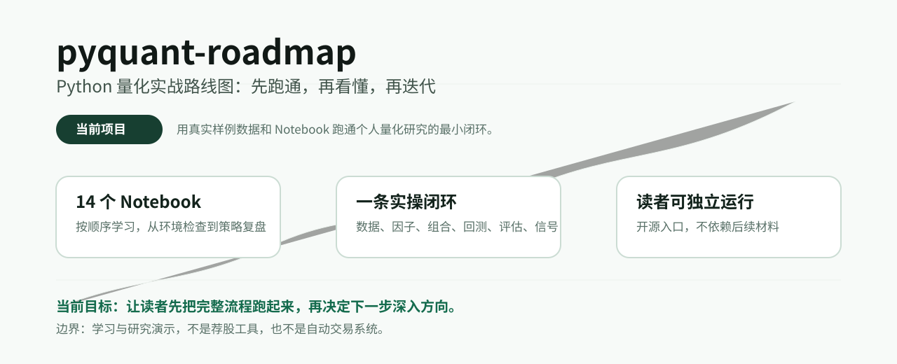
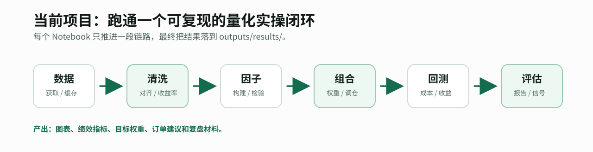
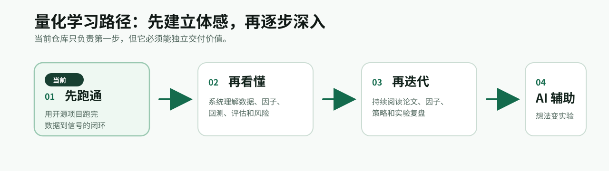

# pyquant-roadmap：Python 量化实战路线图



`pyquant-roadmap` 是一个面向个人学习者的开源 Python 量化实战项目。它不从概念堆砌开始，而是先带你在本地跑通一条完整链路：数据、因子、组合、回测、评估和信号输出。

适合你在第一次系统学习量化交易时使用：先获得“我知道整个流程长什么样”的体感，再决定后面要补数据处理、策略研究、回测框架还是 AI 辅助研究。

## 这个项目解决什么问题

很多量化入门资料会直接进入策略、公式或框架，但初学者最容易卡住的不是某一个函数，而是不知道这些环节之间如何连接。

这个仓库只做一件事：用一组可运行的 Notebook，把个人量化研究的最小闭环跑一遍。



```text
数据获取
-> 数据清洗和收益率
-> 因子构建和检验
-> 组合权重
-> 回测和绩效评估
-> 交易信号与复盘
```

跑完之后，你至少应该能回答：

- 量化策略从数据到信号大致经历哪些步骤；
- Python 在每个步骤里具体处理什么对象；
- 因子、组合、回测、绩效评估之间是什么关系；
- 后续深入学习时，自己应该补哪一块。

## 学习路径

这个项目在整个学习路径里承担第一步：**先跑通**。



```text
先跑通：通过开源项目建立基础体感
再看懂：用系统材料理解每一步背后的框架
再迭代：持续阅读论文、因子、策略和实验复盘
AI 辅助：把想法更快变成代码、实验和复盘材料
```

后续学习材料会通过公众号和小红书更新，相关内容放在文末，不影响你独立使用这个仓库。

## 快速开始

推荐使用 Conda：

```powershell
conda env create -f environment.yml
conda activate pyquant-roadmap
jupyter lab
```

然后打开 `notebooks/`，按文件名前缀从 `01_...ipynb` 运行到 `14_...ipynb`。

如果你已经有自己的 Python 3.11 环境，也可以直接安装依赖：

```powershell
pip install pandas numpy matplotlib scipy statsmodels pyarrow pyyaml akshare bt quantstats ta notebook jupyterlab
```

## Notebook 路线

| 顺序 | 主题 | 你会获得什么 |
| --- | --- | --- |
| 01 | 量化交易全流程与主线案例 | 先看到完整闭环 |
| 02 | 环境、项目结构与第一次运行 | 确认本地能稳定运行 |
| 03 | pandas / NumPy 够用部分 | 补齐表格和数组处理基础 |
| 04 | 数据获取、字段标准化与缓存 | 从数据源拿到可复用行情数据 |
| 05 | 数据清洗、对齐与收益率 | 把行情整理成研究可用格式 |
| 06 | 因子构建 | 把策略直觉变成可计算特征 |
| 07 | 因子有效性检验 | 用 IC 和分层先检查因子 |
| 08 | 组合构建 | 把分数变成目标权重 |
| 09 | 回测引擎 | 理解回测口径和开源框架复现 |
| 10 | 绩效评估与策略报告 | 读懂指标、曲线和基准对比 |
| 11 | 工程化流水线 | 把一次实验整理成可复现流程 |
| 12 | 策略分类地图 | 建立后续学习策略的框架 |
| 13 | 经典策略 | 跑通几个代表性入门策略 |
| 14 | AI 辅助与下一步 | 理解 AI 能帮什么、不能替你判断什么 |

## 项目结构

```text
pyquant-roadmap/
├── notebooks/        # 学习主入口
├── lib/              # Notebook 中沉淀出的复用函数
├── configs/          # 数据和策略配置
├── data/sample/      # 随仓库保留的小型真实样例数据
├── outputs/          # 运行后生成结果，默认不提交
├── assets/           # README 图片和二维码
├── environment.yml
└── README.md
```

`notebooks/` 是主线。`lib/` 不是让你一开始就读源码，而是在 Notebook 讲清原理之后，把会重复用到的逻辑封装起来。

## 数据与结果

仓库随附一个小型真实 ETF 日线样例数据集，保存在 `data/sample/`。第 04 章会展示如何通过 AKShare 获取并缓存同类数据。

运行 Notebook 后，图表、报告、目标权重和订单建议会写入 `outputs/results/`。这些都是本地运行产物，不作为仓库内容提交。

## 继续学习与反馈

如果你跑通项目后，希望继续看系统解释、版本更新、勘误或后续学习路径，可以关注“小圆量化”的公众号和小红书。

<p>
  
  
</p>

## 边界说明

本项目用于量化交易学习和研究方法演示，不构成投资建议；Notebook 输出的回测、指标和订单建议都只是学习材料，不代表未来表现，也不应直接用于真实交易。
